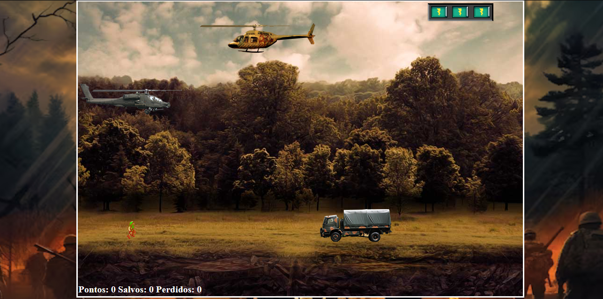

Documentação do Projeto: Resgate

Índice

    Introdução
    Estrutura do Projeto
    Descrição dos Arquivos
    Estilização
    Funcionalidades
    Uso dos Áudios
    Considerações Finais

Introdução

Este projeto é uma aplicação simples de um jogo de resgate, onde o jogador utiliza as teclas W, S, e D para controlar um helicóptero. A interface é composta por um fundo dinâmico e interativo que se ajusta automaticamente ao tamanho da tela, oferecendo uma experiência visual agradável e envolvente.
Estrutura do Projeto

O projeto é organizado em vários arquivos para separar as responsabilidades e facilitar a manutenção do código:

bash

/ (pasta raiz)
├── index.html
├── estilos.css
├── /imgs/
│   └── fundo.jpg
└── /sons/
    ├── som.mp3
    ├── explosao.mp3
    ├── musica_fundo.mp3
    ├── gameover.mp3
    ├── perdido.mp3
    └── resgate.mp3

Descrição dos Arquivos
1. index.html

O arquivo index.html é a estrutura principal do projeto. Ele contém a marcação HTML que define os elementos da interface do jogo.
Estrutura do index.html:

    
: Contém todo o conteúdo do jogo.
    
: Área onde ocorre o jogo.
    
: Tela inicial do jogo, que mostra as instruções e permite o início do jogo ao clicar.
    Tags de Áudio: Áudios que serão utilizados durante o jogo para efeitos sonoros.

2. estilos.css

O arquivo estilos.css define a estilização de todos os elementos presentes no index.html. Ele contém regras para o fundo da página, bem como a organização do layout.
Principais Estilos:

    body: Define o fundo da página com a imagem fundo.jpg, configurada para cobrir todo o fundo sem repetir, mantendo a proporção original.
    #container: Define a estrutura básica do layout, centralizando o conteúdo e ocupando 100% da altura da tela.

3. /imgs/fundo.jpg

A imagem de fundo do jogo, que é aplicada ao corpo da página para criar uma ambientação visual agradável.
4. /sons/

Contém os arquivos de áudio que serão usados durante o jogo, como efeitos sonoros e música de fundo.
Estilização
Fundo da Página

    Imagem de Fundo (fundo.jpg):
        Propriedades:
            background-repeat: no-repeat;: Evita que a imagem se repita.
            background-size: cover;: Ajusta a imagem para cobrir todo o fundo.
            background-position: center;: Centraliza a imagem na tela.
            background-attachment: fixed;: Mantém a imagem fixa durante o scroll.

Estrutura do Layout

    Container:
        O container ocupa 100% da largura e da altura da tela, utilizando display: flex; para centralizar o conteúdo vertical e horizontalmente.

Funcionalidades

    Interatividade:
        O jogo começa quando o usuário clica na área #inicio.
        O helicóptero é controlado pelas teclas W, S, e D.

Uso dos Áudios

Os áudios são carregados automaticamente e estão prontos para serem reproduzidos durante as interações no jogo:

    Som de disparo: som.mp3
    Explosão: explosao.mp3
    Música de fundo: musica_fundo.mp3
    Game Over: gameover.mp3
    Som de resgate: resgate.mp3

Nota Importante

Este projeto é um plágio da plataforma DIO e foi utilizado para fins educacionais e de aprendizado. Não deve ser utilizado para fins comerciais ou divulgação sem as devidas permissões.
